# ▶ 管理员使用流程

## 1 概述

后台总管理员为TTFGame平台中用户所能使用的最高级别权限。管理员账号无法通过正常注册获得，无需过审即可正常使用平台所有功能。

## 2 常规管理详解

点击左侧导航栏中的常规管理可将其展开。

### 2.1 如何配置系统？

展开常规管理栏后，点击展开部分中的系统配置进入系统配置页面。

在系统配置页面中，用户可以在此增改系统的变量和分组，也可以自定义分组和变量。用户点击选择平台右侧后可以在打开的下拉菜单中从所有平台中选择任一平台进行系统配置。所有平台初始均有十个分页：字典配置，交易设置，返利设置，贡献配置，抽奖设置，安全策略，合约设置，支付方式，TTFD售价，提币设置。

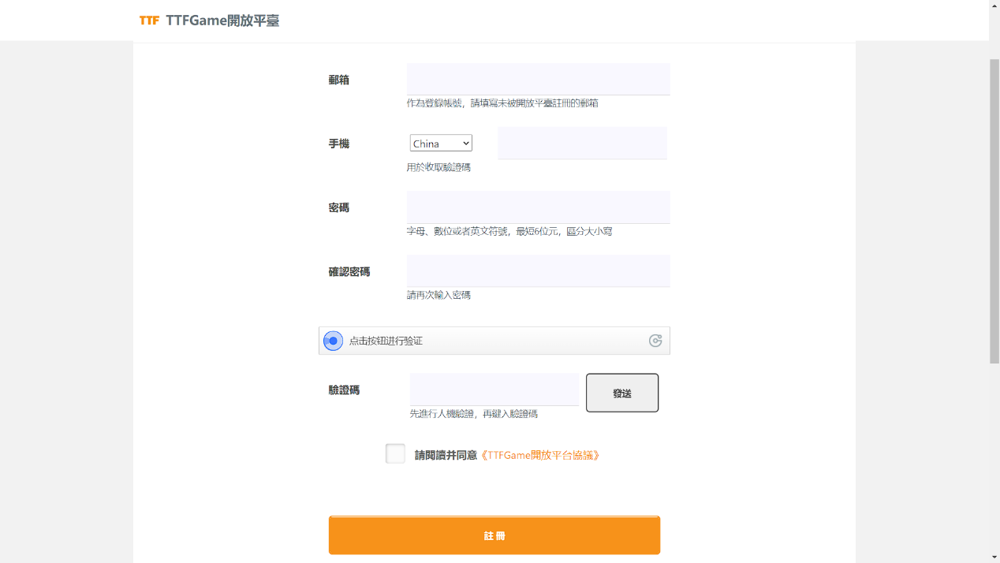

字典配置分页中，用户可以进行配置分组的配置，该分页有十对初始键名-键值组。需要修改时，用户可以直接在对应的文本框内进行修改；点击下方的添加按钮，即可添加新的键名-键值组；点击要删除的键名-键值组右侧的红色×按钮即可删除。修改结束后，点击最下方的确定按钮即保存修改，点击重置则返回修改前的状态。**注意：如果不了解服务端开发，则不要对其进行修改！！**

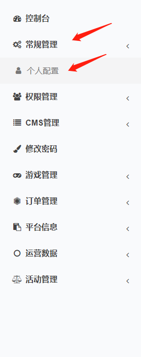

交易设置分页中，用户可以进行手续费区间段的设置。键名为支付区间段上限，键值为手续费比率。如果支付额度超出最后一个区间段上限，则按最后一个比率计算。需要修改时，用户可以直接在对应的文本框内进行修改；点击下方的添加按钮，即可添加新的键名-键值组；点击要删除的键名-键值组右侧的红色×按钮即可删除。修改结束后，点击最下方的确定按钮即保存修改，点击重置则返回修改前的状态。

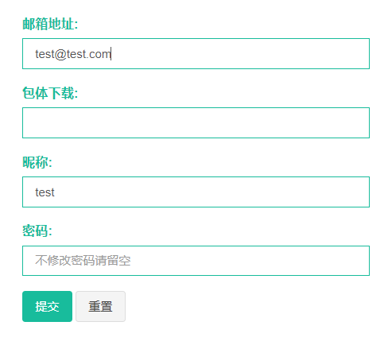

**由于废弃了交易所平台，该页设置也基本无用，如有需要，可以沟通。**

~~返利设置分页中，用户可以进行通过修改不同字段的值进行返利设置。可以修改的字段如下：~~

~~汇率（美元）：默认值为1，该字段代表1美元等于多少TTFD，仅能填入数字。~~

~~单次返利比例：默认值为0.25，该字段表示每次返利（TTFD）占当日返利（TTFD）的比例。~~

~~返利有效时间：默认值为24，该字段表示返利最长有效时间（小时），仅能填入数字。~~

~~返利间隔时间：默认值为2，该字段表示每次返利（TTFD）的间隔时间，仅能填入数字。~~

~~返利结算时间：默认值为22:00，该字段表示每天返利结算时间，24小时制，格式为hh:mm。~~

~~直接结算：默认值为是，该字段代表到结算时间后是否忽略以上配置直接结算返利，点击即可切换为否。~~

~~每日收益显示：默认值为1.425，该字段代表显示的每日收益。~~

~~预期年化显示：默认值为\>30%，该字段代表显示的预期年化。~~

~~邀请积分汇率：默认值为1，该字段表示1TTFD对应的积分值，仅能填入数字。~~

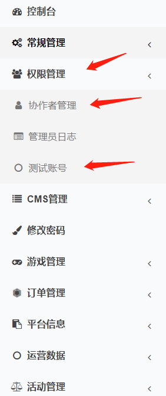

贡献配置分页中，用户可以进行通过修改不同字段的值进行贡献配置。可以修改的字段如下：

青铜：贡献小于2000的用户所处的段位，该字段代表青铜段位的用户的返利值，默认值为0，仅能填入数字。

白银：贡献大于2000后由青铜升级后用户所处的段位，该字段代表白银段位用户的返利值，默认值为30，仅能填入数字。

黄金：贡献大于10000后由白银升级后用户所处的段位，该字段代表黄金段位用户的返利值，默认值为50，仅能填入数字。

铂金：贡献大于20000后由黄金升级后用户所处的段位，该字段代表铂金段位用户的返利值，默认值为100，仅能填入数字。

钻石：贡献大于50000后由铂金升级后用户所处的段位，该字段代表钻石段位用户的返利值，默认值为500，仅能填入数字。

星钻：贡献大于100000后由钻石升级后用户所处的段位，该字段代表星钻段位用户的返利值，默认值为1000，仅能填入数字。

荣耀：贡献大于150000后由星钻升级后用户所处的段位，该字段代表荣耀段位用户的返利值，默认值为2000，仅能填入数字。

王者：贡献大于200000后由荣耀升级后用户所处的段位，该字段代表王者段位用户的返利值，默认值为5000，仅能填入数字。

至尊：贡献大于300000后由王者升级后用户所处的段位，该字段代表至尊段位用户的返利值，默认值为10000，仅能填入数字。

TTFD获得平台贡献：默认值为1，仅能填入数字，该字段代表充值TTFD得到平台贡献的比例。

每周期自动减少：默认值为15，仅能填入数字，该字段代表每周期减少的平台贡献值。

返利要求段位：默认值为青铜，该字段代表获取返利要求的最低段位，仅能从青铜、白银、黄金、铂金、钻石、星钻、荣耀、王者、至尊9个选项中选择。

世界树汲取能量周期：默认值为每周一0点，该字段代表每次世界树汲取能量的世界，仅能在每天0点、每周一0点、每月1日0点3个选项中选择。

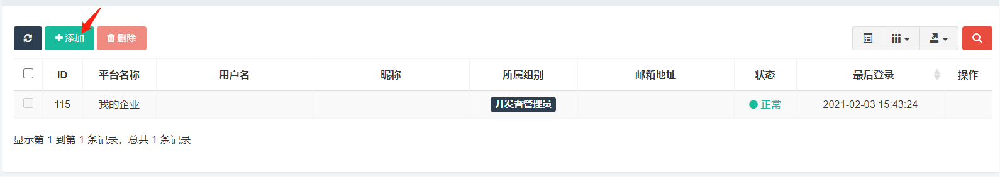

抽奖设置分页中，用户可以进行通过修改不同字段的值进行抽奖设置。可以修改的字段如下：

抽奖积分：默认值为10，仅能填入数字，该字段代表每次抽奖使用的积分。

积分抽成比例：默认值为5，仅能填入数字，该字段代表积分抽成的比例。

大输：默认值为1000，仅能填入数字，该字段代表小于等于该值时为大输。  
小输：默认值为1500，仅能填入数字，该字段代表大于大输小于等于该值时为小输。

小赢：默认值为2000，仅能填入数字，该字段代表大于小输小于等于该值时为小赢。  
大赢：默认值为2500，仅能填入数字，该字段代表大于小赢小于等于该值时为大赢。

触发公告：默认值为0.002，仅能填入数字，该字段代表每次抽奖触发公告的概率。

安全策略分页大部分为多个预警值设置，包括：邮箱预警、用户预警、平台利润、用户回收、游戏回收、游戏利润、分红返利、友情点抽奖、每千份TTFG。

每个预警部分均由type（类型策略）、yellow_rate（黄色警戒值）、red_rate（红色警戒值）、black_rate（黑色警戒值）、day_n（周期）5个字段和它们对应的值组成。

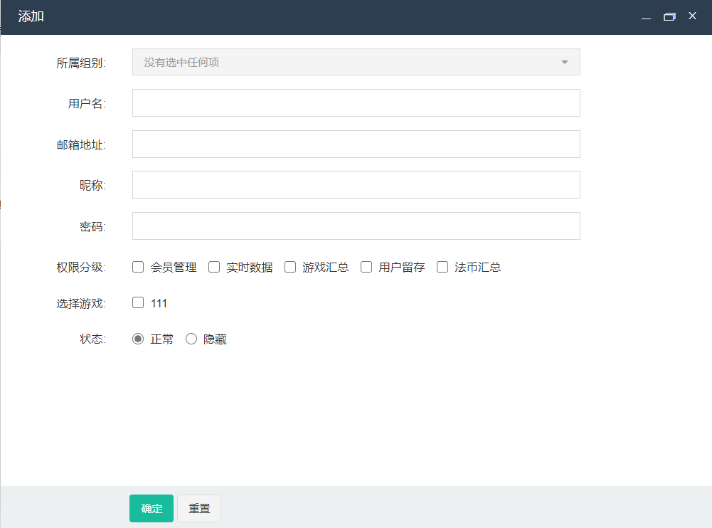

另外，以下设置较为特殊：

商户余额ttfg：默认值为1000，仅可填入数字，该字段代表商户的ttfg余额预警值。  
商户余额ttfd：默认值为1000，仅可填入数字，该字段代表商户的ttfd余额预警值。  
批量注册：批量注册时的时间与注册量的限制。

开放策略平台的app_id：该字段代表开放策略平台的app_id，若有多个请用“,”隔开。

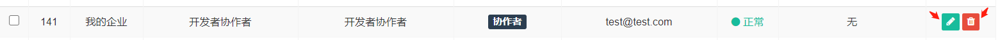

合约设置分页中，用户可以进行通过修改不同字段的值进行贡献配置。可以修改的字段如下：

合约冷却时间：默认值为10，仅可填入数字，该字段代表合约解约后下次可以再次购买的时间，单位为分钟。

理财用户授权名单：该字段代表授权的理财用户的用户ID，若有多个请用“,”隔开，**仅填写的用户可以看到理财页详情**。

支付方式分页中，用户可以进行通过修改不同字段进行支付方式的配置。可以修改的字段如下：

MyCard：默认值为是，该字段代表是否开启MyCard支付方式，点击可切换为否。

PayPal：默认值为否，该字段代表是否开启PayPal支付方式，点击可切换为是。

信用卡：默认值为否，该字段代表是否开启信用卡转账，点击可切换为是。  
银行汇款：默认值为否，该字段代表是否开启银行汇款，点击可切换为是。

EUSTD：默认值为是，该字段代表是否开启EUSTD支付方式，点击可切换为否。

MyCard是否显示：默认值为是，该字段代表是否显示MyCard支付方式，点击可切换为否。

PayPal是否显示：默认值为否，该字段代表是否显示PayPal支付方式，点击可切换为是。

信用卡是否显示：默认值为否，该字段代表是否显示信用卡转账，点击可切换为是。  
银行汇款是否显示：默认值为否，该字段代表是否显示银行汇款，点击可切换为是。

EUSTD是否显示：默认值为是，该字段代表是否显示EUSTD支付方式，点击可切换为否。

TTFD售价分页中，用户可以进行通过修改不同字段的值进行TTFD售价的配置。可以修改的字段如下：

是否可以购买TTFD：默认值为是，该字段代表是否可以购买TTFD，点击可切换为否。

TTFD数量（1\~6）：该字段共有6个，代表6种情况下购买的TTFD的数量，仅可填入数字。

MyCard价格（1\~6）：该字段共有6个，代表6种情况下使用MyCard支付方式购买对应TTFD的价格，仅可填入数字。

PayPal价格（1\~6）：该字段共有6个，代表6种情况下使用PayPal支付方式购买对应TTFD的价格，仅可填入数字。

信用卡价格（1\~6）：该字段共有6个，代表6种情况下使用信用卡转账购买对应TTFD的价格，仅可填入数字。

汇款价格（1\~6）：该字段共有6个，代表6种情况下使用银行汇款购买对应TTFD的价格，仅可填入数字。

EUSTD价格（1\~6）：该字段共有6个，代表6种情况下使用EUSTD支付方式购买对应TTFD的价格，仅可填入数字。

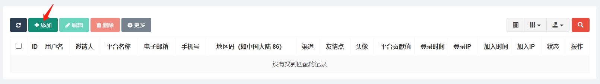

提币设置分页中，用户可以进行通过修改不同字段的值进行提币设置。可以修改的字段如下：

提币手续费：表示进行不同数量的提币时缴纳的手续费的比例。

提币限额：默认值为100，该字段代表每次提币的限额。

提币时间范围设置：默认值为24，该字段代表多少小时内触发提币审核机制。

提币次数范围设置：默认值为0，该字段代表多少次数内触发提币审核机制。

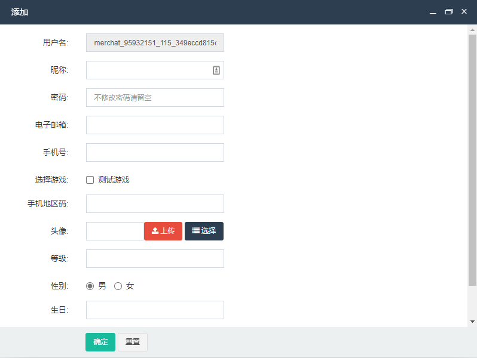

### 2.2 如何管理附件？

**注意：不建议操作本部分。**

展开常规管理栏后，点击展开部分中的附件管理进入附件管理页面。

点击添加按钮打开添加页面，选择上传到本地选择本地文件地址即可完成附件添加。

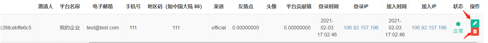

点击要修改的附件操作栏的编辑按钮，在打开的编辑页面中完成信息编辑后点击编辑页面最下方的确定按钮即可完成修改。

可修改的字段如下：

物理路径：附件存储的物理路径，添加附件时自动生成。若修改可能造成该附件无法被识别与使用，请谨慎修改。

宽度：若附件不为图片，则默认值为空；若附件为图片，则默认值为添加附件时由图片的宽度决定。

高度：若附件不为图片，则默认值为空；若附件为图片，则默认值为添加附件时由图片的高度决定。

图片类型：默认值为添加附件时附件的后缀名决定。

图片帧数：默认值为0，仅允许填入数字。修改为小于0的数字保存后会自动重置回0。

文件大小：默认值为添加附件时文件的字节大小，仅允许填入数字。修改为小于0的数字保存后会自动重置回0。

Mime类型:默认值为添加附件时附件的Mine类型决定。

透传数据：默认值为空。

上传时间：默认值为添加附件时上传附件的时间，仅允许修改为时间格式。

存储引擎：若附件为本地上传，默认值为local；若附件为服务器上传，默认值与所上传的服务器相关。

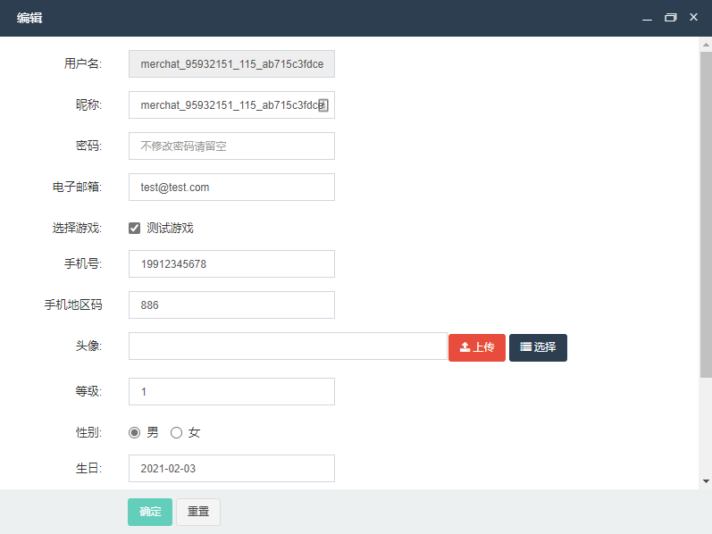

点击要删除的附件操作栏的删除按钮，在弹出的提示页面中确定即可完成删除。

### 2.3 如何管理个人配置？

展开常规管理栏后，点击展开部分中的个人配置进入个人配置页面。

个人配置页面中，支持用户对邮箱地址，包体下载，昵称和密码进行修改。修改结束后点击下方“提交”按钮保存并应用修改，点击“重置”按钮则不保存本次修改重置回修改前的状态。特别的，若用户不想对密码进行修改，请保持密码栏留空。

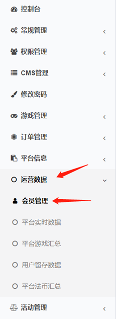

同时，修改密码页面也支持用户进行密码的修改。点击左侧导航栏中的“修改密码”进入修改密码界面，在密码栏和确认密码栏连续输入同样的新密码后点击“确定”即修改密码成功，点击“重置”则放弃修改继续使用修改前的密码。特别的，在本页面修改密码后用户会被强制退出平台，请使用新密码重新进行登录。

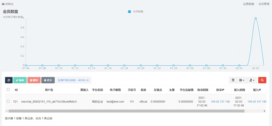

## 3 权限管理详解

点击左侧导航栏中的权限管理可将其展开。

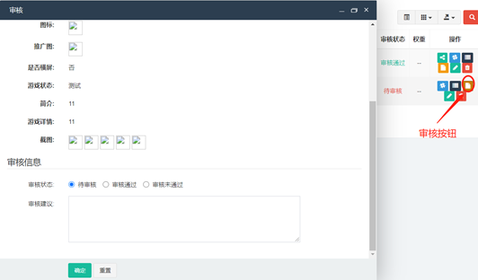

### 3.1 如何管理协作者？

展开权限管理栏后，点击展开部分中的协作者管理进入协作者管理页面。

点击添加按钮打开添加页面，在打开的添加页面中完善信息后点击添加页面最下方的确定按钮即可完成添加。

可添加的字段如下：

所属组别：默认值为“没有选中任何项”，下拉菜单中可选择以下5个选项中的一个或多个：总后台协作者，开发者管理员，开发者协作者，开发者审核未通过，开发者协作者审核未通过。该字段代表新创建用户的所属组别，用户会根据所属组别得到对应的权限，当用户具有多个所属组别时则会得到的所有所属组别能得到的权限。若不选择任何项则会提示“所属组别不能为空”导致添加失败。

用户名：默认值为空，该字段代表新创建用户的用户名。如不填写则会提示“用户名不能为空”导致添加失败。

邮箱地址：默认值为空，该字段代表新创建用户的邮箱地址。如不填写则会提示“邮箱地址不能为空”导致添加失败。

昵称：默认值为空，该字段代表新创建用户的昵称。如不填写则会提示“昵称不能为空”导致添加失败。

密码：默认值为空，该字段代表新创建用户的密码。如不填写则会提示“密码不能为空”导致添加失败。

平台：默认值为“不选择默认管理所有平台”，下拉菜单中可选择所有平台中的任一平台。该字段代表新创建的用户管理或协助管理的平台，若不选择则默认管理或协作管理所有平台，否则仅管理或协助管理所选择的单一平台。

状态：默认值为正常，该字段代表新创建的用户的状态，仅能在正常和隐藏2个选项中进行选择。

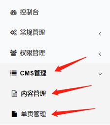

点击要修改的协作者操作栏的编辑按钮，在打开的编辑页面中完成信息编辑后点击编辑页面最下方的确定按钮即可完成修改。

可修改的字段如下：

所属组别：默认值为添加新用户时所选择的所属组别，下拉菜单中可选择以下5个选项中的一个或多个：总后台协作者，开发者管理员，开发者协作者，开发者审核未通过，开发者协作者审核未通过。该字段代表要修改的用户的所属组别，用户会根据所属组别得到对应的权限，当用户具有多个所属组别时则会得到的所有所属组别能得到的权限。若不选择任何项则会提示“所属组别不能为空”导致修改失败。

用户名：默认值为添加新用户时所填写的用户名，该字段代表要修改的用户的用户名。如不填写则会提示“用户名不能为空”导致修改失败。

邮箱地址：默认值为添加新用户时所填写的邮箱地址，该字段代表要修改的用户的邮箱地址。如不填写则会提示“邮箱地址不能为空”导致修改失败。

昵称：默认值为添加新用户时所填写的昵称，该字段代表要修改的用户的昵称。如不填写则会提示“昵称不能为空”导致修改失败。

密码：默认值为空（即使要修改的账号确实拥有原密码），该字段代表要修改的用户的密码。如不填写则会维持原密码不进行修改。

登录失败次数：默认值为0，仅允许填入数字，修改为小于0的数字保存后会自动重置回0。该字段代表用户登录失败的次数。

平台：默认值为添加新用户时所选择的平台，下拉菜单中可选择所有平台中的任一平台及“不选择默认管理所有平台”。该字段代表要修改的用户管理或协助管理的平台，若不选择则默认管理或协作管理所有平台，否则仅管理或协助管理所选择的单一平台。

状态：默认值为添加新用户时所选择的状态，该字段代表要修改的用户的状态，仅能在正常和隐藏2个选项中进行选择。

点击要删除的协作者操作栏的删除按钮，在弹出的提示页面中确定即可完成删除。

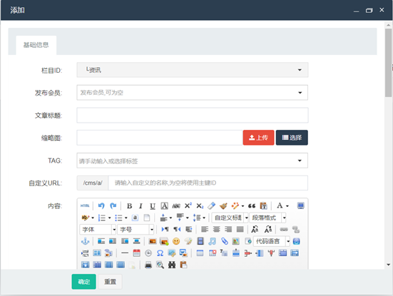

### 3.2 如何管理角色权限？

展开权限管理栏后，点击展开部分中的角色组进入角色组管理页面。

点击添加按钮打开添加页面，在打开的添加页面中完善信息后点击添加页面最下方的确定按钮即可完成添加。

可添加的字段如下：

父级：默认值为后台总管理员，下拉菜单中可选择以下6个选项中的一个：后台总管理员，总后台协作者，开发者管理员，开发者协作者，开发者审核未通过，开发者协作者审核未通过。该字段代表新增角色组的父级角色组。

名称：默认值为空，该字段代表新增角色组的名称。如不填写则会提示“名称不能为空”导致添加失败。

权限：默认值为所选父级拥有的所有权限，用户可通过在该字段中勾选所需权限的方式为新增角色组增加权限。

状态：默认值为添加新用户时所选择的状态，该字段代表新创建的角色组的状态，仅能在正常和隐藏2个选项中进行选择。

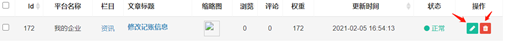

点击要修改的角色组操作栏的编辑按钮，在打开的编辑页面中完成信息编辑后点击编辑页面最下方的确定按钮即可完成修改。

可修改的字段如下：

父级：默认值为添加时用户所选择的父级，下拉菜单中可选择以下6个选项中的一个：后台总管理员，总后台协作者，开发者管理员，开发者协作者，开发者审核未通过，开发者协作者审核未通过。该字段代表要修改的角色组的父级角色组。

名称：默认值为添加时用户所填写的名称，该字段代表要修改的角色组的名称。如不填写则会提示“名称不能为空”导致修改失败。

权限：默认值为添加时用户所选择的权限，用户可通过在该字段中通过点击的方式勾选或取消勾选权限的方式为要修改的角色组修改权限。

状态：默认值为添加时用户所选择的状态，该字段代表要修改的角色组的状态，仅能在正常和隐藏2个选项中进行选择。

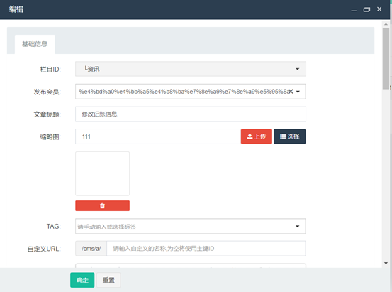

点击要删除的角色组操作栏的删除按钮，在弹出的提示页面中确定即可完成删除。

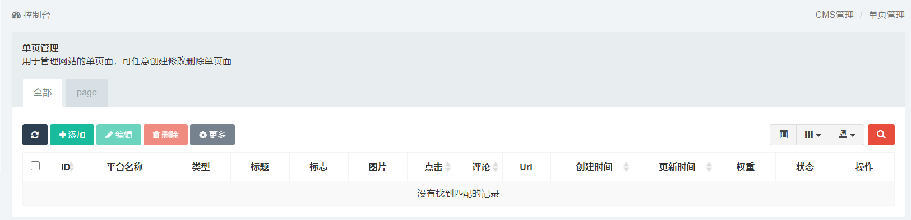

### 3.3 如何管理测试账号？

展开权限管理栏后，点击展开部分中的测试账号进入测试账号页面。

后续流程与[管理员协作者使用流程2.1](?id=_21-如何管理测试账号？)相同。

### 3.4 如何审核开发者？

展开权限管理栏后，点击展开部分中的开发者审核进入开发者审核页面。

后续流程与[管理员协作者使用流程2.2](?id=_22-如何审核开发者？)相同。

## 4 CMS管理详解

点击左侧导航栏中的CMS管理可将其展开。

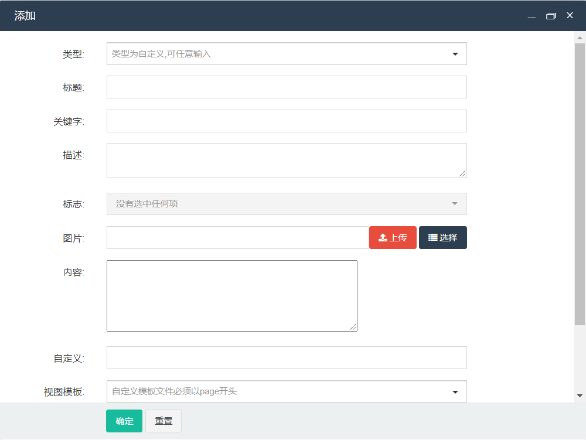

### 4.1 如何管理栏目？

展开CMS管理栏后，点击展开部分中的栏目管理进入栏目管理页面。

因栏目管理中会使用到已创建的模型，建议进行栏目管理流程前先进行模型管理。

后续流程与[管理员协作者使用流程3.1](?id=_31-如何管理栏目？)相同。

### 4.2 如何管理内容？

展开CMS管理栏后，点击展开部分中的内容管理进入内容管理页面。

因内容管理中会使用到已创建的栏目，建议进行内容管理流程前先进行栏目管理。

后续流程与[管理员协作者使用流程3.2](?id=_32-如何管理内容？)相同。

### 4.3 如何管理单页？

展开CMS管理栏后，点击展开部分中的单页管理进入单页管理页面。

后续流程与[管理员协作者使用流程3.3](?id=_33-如何管理单页？)相同。

## 5 游戏管理详解

点击左侧导航栏中的游戏管理可将其展开。

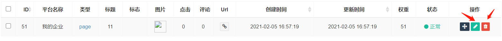

### 5.1 如何管理游戏？

展开游戏管理栏后，点击展开部分中的游戏管理进入游戏管理页面。

点击添加按钮打开添加页面，在打开的添加页面中完善信息后点击添加页面最下方的确定按钮即可完成添加。

可添加的字段如下：

游戏名称：默认值为空，该字段代表新创建游戏的游戏名称。如不填写则会提示“游戏名称不能为空”导致添加失败。

官方链接：默认值为空，该字段代表新创建游戏的官方链接。如不填写则会提示“官方链接不能为空”导致添加失败。如不填写有效的URL地址则会提示“链接不是有效的URL地址”导致添加失败。**这里地址必须是游戏入口实际地址。**

平台名称：该字段代表新创建游戏所归属的平台，用户需在下拉菜单中的所有平台中选择任一平台。

游戏类型：该字段代表新创建游戏的游戏类型，用户需要下拉菜单中从全平台公有的游戏类型和游戏所属平台专有的游戏类型中选择任一类型。

APP类型：默认值为H5，该字段代表新创建的游戏的APP类型，仅能在H5和APP两个选项中进行选择。**只有选择H5的时候可以直接进入游戏，否则将会跳转到浏览器页面展示官方链接地址。**

重要标签：默认值为热门、最新、推荐三个标签均为未添加状态，该字段代表新创建的游戏所使用的重要标签，通过点击对应标签可以添加对应的重要标签。允许不添加或添加一到多个重要标签。

标签：默认值为空，可以手动输入或在全平台公有的标签和游戏所属平台专有的标签中进行选择。该字段代表新创建的游戏三个重要标签外使用的其他标签，允许不添加或添加一到多个。

图标：默认值为空。该字段代表所创建游戏所使用的图标，用户可点击右侧上传按钮上传图片或直接填入图片链接地址。上传图片尺寸需为512\*512px,格式必须为JPG或PNG，若不符合要求则会出现报错提示。如不添加则会提示“图标不能为空”导致添加失败。

推广图：默认值为空。该字段代表所创建游戏主要作为游戏详情页置顶图所使用的推广图，用户可点击右侧上传按钮上传图片或直接填入图片链接地址。上传图片尺寸需为1024\*500px,格式必须为JPG或PNG，若不符合要求则会出现报错提示。如不添加则会提示“推广图不能为空”导致添加失败。

游戏状态：默认值为开放，该字段代表新创建的游戏的游戏状态，仅能在开放、敬请期待、预约和测试四个选项中进行选择。**其中，只有开放状态可以在用户客户端App中看到，而测试状态可以在测试客户端App中看到。敬请期待和预约暂时都未在客户端展示。**

是否横屏：默认值为否，该字段代表新创建游戏是否为横屏游戏，点击即可切换为是。**这是是否在App端横屏展示游戏的唯一依据。**

在线人数：默认值为空，该字段代表新创建游戏的在线人数，如不填写则会提示“在线人数不能为空”导致添加失败。

返利比例：默认值为0，该字段代表新创建游戏的返利比例。与交易所平台一同废弃。

是否自有：默认值为否，该字段代表新创建游戏是否为自有游戏，点击即可切换为是。**自有游戏可以使用一些特定接口。**

权重：默认值为0，该字段代表新创建游戏的权重值，权重值越高的游戏在游戏管理表格中出现得越靠前。

简介：默认值为空，该字段代表新创建游戏的简介，如不填写则会提示“简介不能为空”导致添加失败。

游戏详情：默认值为空，该字段代表新创建游戏的游戏详情，如不填写则会提示“游戏详情不能为空”导致添加失败。

截图：默认值为空。该字段代表所创建游戏的截图，至少需要上传5场或以上，用户可点击右侧上传按钮上传图片或直接填入图片链接地址（填入多个地址时中间需要以逗号分隔）。上传图片的建议尺寸为横板游戏1280\*720px以上，竖板游戏720\*1280px以上,格式必须为JGP或PNG，若不符合要求则会出现报错提示。如不添加则会提示“截图不能为空”导致添加失败。如上传图片数量不足则会提示“上传图片数量不足5张”导致添加失败。

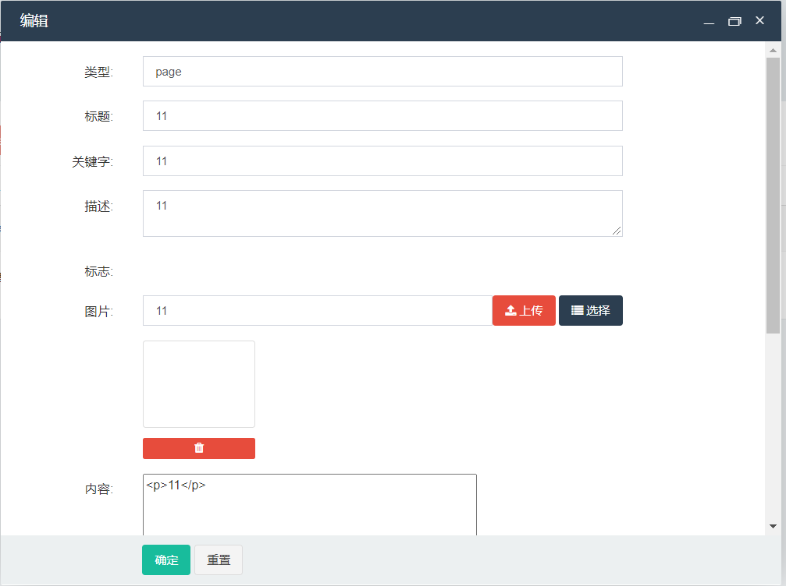

点击要修改的游戏操作栏的编辑按钮，在打开的编辑页面中完成信息编辑后点击编辑页面最下方的确定按钮即可完成修改。

可修改字段除去默认值均为添加游戏时用户填写或选择的值外，字段含义和限制均与可添加字段中对各字段的介绍相同。

点击要删除的游戏操作栏的删除按钮，在弹出的提示页面中确定即可完成删除。

### 5.2 如何审核游戏？

展开游戏管理栏后，点击展开部分中的游戏管理进入游戏管理页面。

后续流程与[管理员协作者使用流程4.1](?id=_41-如何审核游戏？)相同。

### 5.3 如何发布或撤回游戏？

展开游戏管理栏后，点击展开部分中的游戏管理进入游戏管理页面。

后续流程与[管理员协作者使用流程4.2](?id=_42-如何发布或撤回游戏？)相同。

### 5.4 如何管理游戏类型？

展开游戏管理栏后，点击展开部分中的类型管理进入类型管理页面。

后续流程与[管理员协作者使用流程4.3](?id=_43-如何管理游戏类型？)相同。

### 5.5 如何管理游戏轮播图？

展开游戏管理栏后，点击展开部分中的轮播图管理进入轮播图管理页面。

后续流程与[管理员协作者使用流程4.4](?id=_44-如何管理游戏轮播图？)相同。

### 5.6 如何管理游戏礼包？

展开游戏管理栏后，点击展开部分中的礼包管理进入礼包管理页面。

后续流程与[管理员协作者使用流程4.5](?id=_45-如何管理游戏礼包？)相同。

### 5.7 如何管理游戏商品？

展开游戏管理栏后，点击展开部分中的商品管理进入商品管理页面。

后续流程与[管理员协作者使用流程4.6](?id=_46-如何管理游戏商品？)相同。

## 6 平台信息详解

点击左侧导航栏中的平台信息可将其展开。

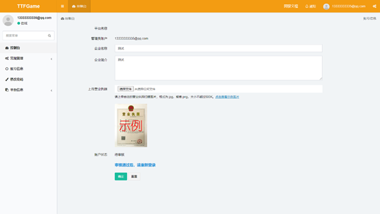

### 6.1 如何管理平台通知？

展开平台信息栏后，点击展开部分中的平台通知进入平台通知管理页面

后续流程与[管理员协作者使用流程5.1](?id=_51-如何管理平台通知？)相同

### 6.2 如何处罚开发者？

展开平台信息栏后，点击展开部分中的开发者处罚记录进入开发者处罚管理页面

后续流程与[管理员协作者使用流程5.2](?id=_52-如何处罚开发者？)相同

### 6.3 如何管理平台？

展开平台信息栏后，点击展开部分中的平台管理进入平台管理页面

后续流程与[管理员协作者使用流程5.3](?id=_53-如何管理平台？)相同

## 7 活动管理详解

点击左侧导航栏中的活动管理可将其展开。

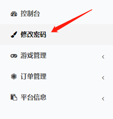

### 7.1 如何管理积分抽奖？

展开活动管理栏后，点击展开部分中的积分抽奖管理进入积分抽奖管理页面。

后续流程与[管理员协作者使用流程6.1](?id=_61-如何管理积分抽奖？)相同。

### 7.2 如何管理合约？

展开活动管理栏后，点击展开部分中的合约管理进入合约管理页面。

后续流程与[管理员协作者使用流程6.2](?id=_62-如何管理合约？)相同。

 

# ▶ 管理员协作者使用流程

## 1 概述

管理员协作者账号为管理员用户所创建。管理员协作者通过开发者创建账号时设定的用户名和密码即可于TTFGame平台首页进行登录。管理员协作者无需过审即可直接正常使用平台功能。

## 2 权限管理详解

点击左侧导航栏中的权限管理可将其展开。

### 2.1 如何管理测试账号？

展开权限管理栏后，点击展开部分中的测试账号进入测试账号页面。

点击添加按钮打开添加页面，在打开的添加页面中完善信息后点击添加页面最下方的确定按钮即可完成添加。

**必填字段如下：**

用户名：默认值为系统自动生成，不可修改，该字段代表新创建的测试账号的用户名。

昵称：默认值与用户名相同，该字段代表要修改的测试账号的昵称。如不填写则会提示“昵称不能为空”导致修改失败。

**可添加的字段如下：**

密码：默认值为空，该字段代表新创建的测试账号的密码。**建议填写，用于测试账号在开放平台版测试客户端登录。**

电子邮箱：默认值为空，该字段代表新创建的测试账号使用者的电子邮箱。

手机号：默认值为空，该字段代表新创建的测试账号使用者的手机号。**建议填写，用于测试账号在开放平台版测试客户端登录。**

手机地区码：默认值为空，该字段代表新创建的测试账号使用者的手机地区码。**开放平台版测试客户端登录必须一致。**

头像：默认值为空，该字段代表新创建的测试账号的头像。用户可点击右侧上传按钮上传图片或直接填入图片链接地址。

等级：默认值为空，该字段代表新创建的测试账号的等级。

性别：默认值为男，该字段代表新创建的测试账号使用者的性别，仅能在男和女两个选项中进行选择。

生日：默认值为空，该字段代表新创建的测试账号使用者的生日，仅支持填写标准日期格式。

格言：默认值为空，该字段代表新创建的测试账号使用者的格言。

点击要修改的测试账号操作栏的编辑按钮，在打开的编辑页面中完成信息编辑后点击编辑页面最下方的确定按钮即可完成修改。

**必填字段如下：**

用户名：默认值为系统自动生成，不可修改，该字段代表新创建的测试账号的用户名。

昵称：默认值与用户名相同，该字段代表要修改的测试账号的昵称。如不填写则会提示“昵称不能为空”导致修改失败。

**可修改的字段如下：**

密码：默认值为空（即使要修改的测试账号确实拥有原密码），该字段代表要修改的测试账号的密码。如不填写则会维持原密码不进行修改。

电子邮箱：默认值为添加时用户所填写的电子邮箱，该字段代表要修改的测试账号使用者的电子邮箱。

平台名称：该字段代表有修改的测试账号所属的平台，用户需在下拉菜单的所有平台中任选一个平台。

手机号：默认值为添加时用户所填写的手机号，该字段代表要修改的测试账号使用者的手机号。

手机地区码：默认值为添加时用户所填写的手机地区码，该字段代表要修改的测试账号使用者的手机地区码。

头像：默认值为添加时用户所选择的头像，该字段代表要修改的测试账号的头像。用户可点击右侧上传按钮上传图片或直接填入图片链接地址添加图片，点击图片下方的红色垃圾桶图标删除图片。

等级：默认值为添加时用户所填写的等级，该字段代表要修改的测试账号的等级。

性别：默认值为添加时用户所选择的性别，该字段代表要修改的测试账号使用者的性别，仅能在男和女两个选项中进行选择。

生日：默认值为添加时用户所填写的生日，该字段代表要修改的测试账号使用者的生日，仅支持填写标准日期格式。

格言：默认值为添加时用户所填写的格言，该字段代表要修改的测试账号使用者的格言。

余额：默认值为0.00，仅允许填入数字，修改为小于0的数字保存后会自动重置回0。该字段代表要修改的测试账号的余额。如不填写则会提示“余额不能为空”导致修改失败。

连续登录天数：默认值为0，仅允许填入数字，修改为小于0的数字保存后会自动重置回0。该字段代表要修改的测试账号的连续登录天数。如不填写则会提示“连续登录天数不能为空”导致修改失败。

最大连续登录天数：默认值为0，仅允许填入数字，修改为小于0的数字保存后会自动重置回0。该字段代表要修改的测试账号的最大连续登录天数。如不填写则会提示“最大连续登录天数不能为空”导致修改失败。

上次登录时间：默认值为1970-01-01
08:00:00，该字段代表要修改的测试账号的上次登录时间，仅支持填写标准日期格式。如不填写则会提示“上次登录时间不能为空”导致修改失败。

登录时间：默认值为测试账号的创建时间，该字段代表要修改的测试账号的登录时间，仅支持填写标准日期格式。如不填写则会提示“登录时间不能为空”导致修改失败。

登录IP：默认值为测试账号注册时用户使用的IP地址，该字段代表要修改的测试账号的登录IP。如不填写则会提示“登录IP不能为空”导致修改失败。

失败次数：默认值为0，仅允许填入数字，修改为小于0的数字保存后会自动重置回0。该字段代表要修改的测试账号的登录失败次数。如不填写则会提示“失败次数不能为空”导致修改失败。

加入IP：默认值为测试账号注册时用户使用的IP地址，该字段代表要修改的测试账号的加入IP。如不填写则会提示“加入IP不能为空”导致修改失败。

加入时间：默认值为测试账号的创建时间，该字段代表要修改的测试账号的登录时间，仅支持填写标准日期格式。如不填写则会提示“加入时间不能为空”导致修改失败。

屏蔽回收：默认值为否，该字段代表要修改的测试账号是否屏蔽回收，点击即可切换为是。

是否封号：默认值为否，该字段代表要修改的测试账号是否被封号，点击即可切换为是。

状态：默认值为添加时用户所选择的状态，该字段代表要修改的测试账号的状态，仅能在正常和隐藏2个选项中进行选择。

点击要删除的测试账号操作栏的删除按钮，在弹出的提示页面中确定即可完成删除。

### 2.2 如何审核开发者？

展开权限管理栏后，点击展开部分中的开发者审核进入开发者审核页面。

点击要审核的信息操作栏的审核详情按钮进入审核详情页面。通过在该页面改变审核状态的方式来表明审核结果。修改审核状态并填写审核建议后点击审核详情最下方的确定按钮即保存审核结果。审核结果保存后，系统会将审核状态和审核建议以公告的形式发送给被审核的平台以通知本次审核的结果。审核状态被修改为“审核通过”的平台即为通过审核，可以正常使用平台功能；审核状态被修改为“审核未通过”的平台即为不通过审核，需要按审核建议修改审核信息后重新发起审核申请。

审核详情页面中出现的字段如下：

平台名称：该字段代表要审核的平台的平台名称，仅供查看无法修改。

管理员账户：该字段代表要审核的平台的管理员账号的用户名，仅供查看无法修改。

企业/个人名称：该字段代表要审核的平台提交审核申请时填写的企业名称，仅供查看无法修改。

补充说明：该字段代表要审核的平台提交审核申请时填写的企业简介，仅供查看无法修改。

上传图片：该字段代表要审核的平台提交审核申请时上传的图片，仅供查看无法修改

状态：默认值为待审核，该字段代表要审核的平台的审核状态，仅能在待审核、审核通过、审核未通过3个选项中进行选择。

审核建议：默认值为空，该字段代表此次审核中将发送给要审核的平台的审核建议。**如不填写则会提示“审核建议不能为空”导致审核失败。**

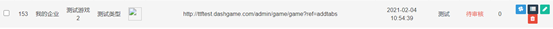

点击要删除的审核信息操作栏的删除按钮，在弹出的提示页面中确定即可完成删除。

## 3 CMS管理详解

点击左侧导航栏中的CMS管理可将其展开。

### 3.1 如何管理栏目？

展开CMS管理栏后，点击展开部分中的栏目管理进入栏目管理页面。

点击添加按钮打开添加页面，在打开的添加页面中完善信息后点击添加页面最下方的确定按钮即可完成添加。

**注意：栏目尽量不要随意变动，如有需要，先联系总管理员。**

可添加的字段如下：

类型：默认值为栏目，该字段代表要添加的栏目的类型，仅能在栏目、列表、外部链接3个选项中进行选择。栏目类型下不可以发布文章,但可以添加子栏目、列表、链接；列表类型下可以发布文章,但不能添加子栏目；链接类型下不可以发布文章和子级栏目。同时，根据所选择的类型，剩余字段也会出现区别。

模型ID：仅在类型为栏目或列表时出现的字段，该字段代表要添加的栏目使用的模型的模型名称，用户需在下拉菜单的所有模型中任选一个模型。

上级栏目：默认值为“无”，该字段代表要添加的栏目的上级栏目，用户需在下拉菜单的所有栏目中任选一个栏目或在要添加的栏目没有上级栏目时选择“无”。

名称：默认值为空，该字段代表要添加的栏目的名称，不能为纯数字。如不填写则会提示“名称不能为空”导致添加失败。如果需要一次录入多个分类时请换行输入，录入多个时将忽略自定义名称，批量录入格式为：分类名称\|自定义名称。

图片：默认值为空，该字段代表要添加的栏目的图片。用户可点击右侧上传按钮上传图片或直接填入图片链接地址。

关键字：仅在类型为栏目或列表时出现的字段，默认值为空，该字段代表要添加的栏目的关键字。

描述：仅在类型为栏目或列表时出现的字段，默认值为空，该字段代表要添加的栏目的描述。

自定义名称：默认值为空，该字段代表要添加的栏目的自定义名称，不能为纯数字。如不填写则会提示“自定义名称格式不正确”导致添加失败。

栏目页模板：仅在类型为栏目时出现的字段，默认值为模型ID所选择的模型的栏目页模板，该字段表示新创建的栏目使用的模型的的栏目页模板。用户可自行填写以channel开头的自定义模板文件名或点击右侧箭头在下拉菜单中选择预设的模板文件channel.html。

列表页模板：仅在类型为列表时出现的字段，默认值为模型ID所选择的模型的列表页模板，该字段表示新创建的栏目使用的模型的的列表页模板。用户可自行填写以list开头的自定义模板文件名或点击右侧箭头在下拉菜单中在预设的模板文件list_news.html和list_product.html中选择。

详情页模板：仅在类型为列表时出现的字段，默认值为模型ID所选择的模型的详情页模板，该字段表示新创建的栏目使用的模型的栏目页模板。用户可自行填写以show开头的自定义模板文件名或点击右侧箭头在下拉菜单中在预设的模板文件show_product.html、show_info.html、show_news.html和show_content.html中选择。

分页大小：仅在类型为列表时出现的字段，默认值为10，仅允许填入数字，该字段表示新创建的栏目中分页的大小。

外部链接：仅在类型为外部链接时出现的字段，默认值为空，该字段表示新创建的栏目的外部链接地址，如不填写则会提示“外部链接不能为空”导致添加失败。

状态：默认值为正常，该字段代表要添加的栏目的状态，仅能在正常和隐藏2个选项中进行选择。

点击要修改的栏目操作栏的编辑按钮，在打开的编辑页面中完成信息编辑后点击编辑页面最下方的确定按钮即可完成修改。

**注意：栏目尽量不要随意变动，如有需要，先联系总管理员。**

可修改字段除以下三点外，字段含义和限制均与可添加字段中对各字段的介绍相同：

1、各字段默认值为要修改的栏目添加时用户填入或选择的值。

2、类型和模型ID仅可查看不可被修改。

3、增加可供修改的新字段权重，该字段仅允许填入数字，该字段代表在栏目管理页面中该栏目的权重值，权重值越高的栏目在栏目管理表格中出现得越靠前。

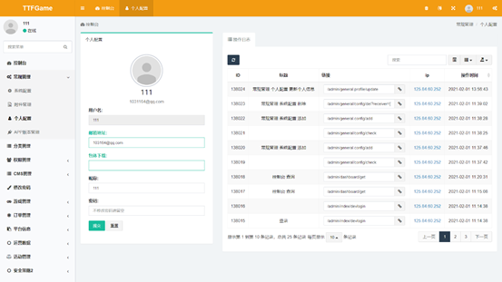

点击要删除的栏目操作栏的删除按钮，在弹出的提示页面中确定即可完成删除。

### 3.2 如何管理内容？

展开CMS管理栏后，点击展开部分中的内容管理进入内容管理页面。

因内容管理中会使用到已创建的栏目，建议进行内容管理流程前先进行栏目管理。

点击添加按钮打开添加页面，在打开的添加页面中完善信息后点击添加页面最下方的确定按钮即可完成添加。

可添加的字段如下：

基础信息部分

栏目ID：该字段代表要添加的内容使用的栏目的栏目名称，用户需在下拉菜单的所有栏目中任选一个栏目。

发布会员：默认值为空，该字段代表要添加的内容的发布会员，可为空。

文章标题：默认值为空，该字段代表要添加的内容的文章标题，如不填写则会提示“文章标题不能为空”导致添加失败。

缩略图：默认值为空，该字段代表要添加的内容的缩略图。用户可点击右侧上传按钮上传图片或直接填入图片链接地址。

TAG：默认值为空，该字段代表要添加的内容的标签。用户可以手动输入或或点击右侧箭头在下拉菜单中选择预设的标签。

自定义URL：默认值为空，该字段代表要添加的内容的自定义URL，若为空将自动使用主键ID。

内容：默认值为空，该字段代表要添加的内容，用户可使用富文本编辑器辅助编辑。如不填写则会提示“内容不能为空”导致添加失败。

关键字：默认值为空，该字段代表要添加的内容的关键字。

描述：默认值为空，该字段代表要添加的内容的描述。

相关信息部分

浏览：默认值为0，仅允许填入数字，填入小于0的数字保存后会自动重置回0。该字段代表要添加的内容的被浏览次数。

评论：默认值为0，仅允许填入数字，填入小于0的数字保存后会自动重置回0。该字段代表要添加的内容的被评论次数。

点赞：默认值为0，仅允许填入数字，填入小于0的数字保存后会自动重置回0。该字段代表要添加的内容的被点赞次数。

点踩：默认值为0，仅允许填入数字，填入小于0的数字保存后会自动重置回0。该字段代表要添加的内容的被点踩次数。

状态部分

标志：默认值为没有选中任何项，该字段表示要添加的内容的标志，点击右侧箭头在下拉菜单中预设的三个标志热门、NEW、推荐中可以选择一项或多项。

状态：默认值为正常，该字段表示要添加的内容的状态，仅可在通过点击右侧箭头在下拉菜单中出现的预设的四个状态正常、隐藏、已拒绝、以下线中选择。

发布：默认值为当前日期的00:00:00，该字段表示要添加的内容的发布时间，仅支持时间格式。

点击要修改的内容操作栏的编辑按钮，在打开的编辑页面中完成信息编辑后点击编辑页面最下方的确定按钮即可完成修改。

可修改字段除以下两点外，字段含义和限制均与可添加字段中对各字段的介绍相同：

1、各字段默认值为要修改的内容添加时用户填入或选择的值。

2、增加可供修改的新字段权重，该字段仅允许填入数字，该字段代表在内容管理页面中该内容的权重值，权重值越高的内容在内容管理表格中出现得越靠前。

点击要删除的内容操作栏的删除按钮，在弹出的提示页面中确定即可完成删除。

**注意：请自行确认删除的内容不会影响到客户端App显示，如有问题请联系总管理员。**

### 3.3 如何管理单页？

展开CMS管理栏后，点击展开部分中的单页管理进入单页管理页面。

点击添加按钮打开添加页面，在打开的添加页面中完善信息后点击添加页面最下方的确定按钮即可完成添加。

**注意：单页的作用与客户端App密切相关，如要新增，请联系总管理员进行协调。**

可添加的字段如下：

类型：默认值为空，该字段代表要添加的单页的类型。用户可以手动填写自定义类型或或点击右侧箭头在下拉菜单中选择预设的类型page。如不填写则会提示“类型不能为空”导致添加失败。

平台名称：该字段代表要添加的单页所归属的平台，用户需在下拉菜单中的所有平台中选择任一平台。

标题：默认值为空，该字段代表要添加的单页的标题。如不填写则会提示“标题不能为空”导致添加失败。

关键字：默认值为空，该字段代表要添加的单页的关键字。

描述：默认值为空，该字段代表要添加的单页的描述。

标志：默认值为没有选中任何项，该字段表示要添加的单页的标志，点击右侧箭头在下拉菜单中预设的三个标志热门、首页、推荐中可以选择一项或多项。

图片：默认值为空，该字段代表要添加的单页的图片。用户可点击右侧上传按钮上传图片或直接填入图片链接地址。

内容：默认值为空，该字段代表要添加的内容，用户可使用富文本编辑器辅助编辑。

自定义：默认值为空，该字段代表要添加的单页的自定义内容。如不填写则会提示“自定义不能为空”导致添加失败。

视图模板：默认值为空，该字段表示要添加的单页使用的视图模板。用户可自行填写以page开头的自定义模板文件名或点击右侧箭头在下拉菜单中选择预设的模板文件page.html。

权重：默认值为0，该字段仅允许填入数字，该字段代表在单页管理页面中该单页的权重值，权重值越高的单页在单页管理表格中出现得越靠前。

状态：默认值为正常，该字段代表要添加的单页的状态，仅能在正常和隐藏2个选项中进行选择。

点击要修改的单页操作栏的编辑按钮，在打开的编辑页面中完成信息编辑后点击编辑页面最下方的确定按钮即可完成修改。

可修改字段除以下两点外，字段含义和限制均与可添加字段中对各字段的介绍相同：

1、各字段默认值为要修改的单页添加时用户填入或选择的值。

2、增加如下可供修改的新字段：

点击：默认值为0，仅允许填入数字，填入小于0的数字保存后会自动重置回0。该字段代表要修改的单页的被点击次数。

评论：默认值为0，仅允许填入数字，填入小于0的数字保存后会自动重置回0。该字段代表要修改的单页的被评论次数。

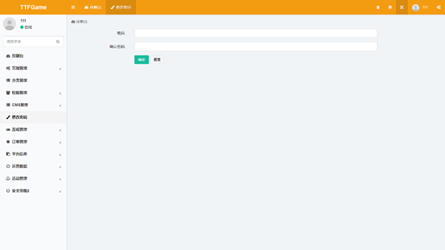

点击要删除的单页操作栏的删除按钮，在弹出的提示页面中确定即可完成删除。

**注意：单页的作用与客户端App密切相关，请勿随意删除，如有需要，请联系总管理员。**

## 4 游戏管理详解

点击左侧导航栏中的游戏管理可将其展开。

### 4.1 如何审核游戏？

展开游戏管理栏后，点击展开部分中的游戏管理进入游戏管理页面。

点击要审核的游戏操作栏的审核详情按钮进入审核详情页面。通过在该页面改变审核状态的方式来表明审核结果。修改审核状态并填写审核建议后点击审核详情最下方的确定按钮即保存审核结果。审核结果保存后，系统会将审核状态和审核建议以公告的形式发送给被审核的平台以通知本次审核的结果。审核状态被修改为“审核通过”的游戏即为通过审核，允许开发者发布；审核状态被修改为“审核未通过”的游戏即为不通过审核，需要按审核建议修改审核信息后重新发起审核申请。

审核详情页面中出现的字段如下：

游戏名称：该字段代表要审核的游戏的名称，仅供查看无法修改。

官方链接：该字段代表要审核的游戏的官方链接，仅供查看无法修改。

游戏类型：该字段代表要审核的游戏的类型，仅供查看无法修改。  
APP类型：该字段代表要审核的游戏的APP类型，仅供查看无法修改。

标签：该字段代表要审核的游戏的标签，仅供查看无法修改。

图标：该字段代表要审核的游戏的图标，仅供查看无法修改。

推广图：该字段代表要审核的游戏的推广图，仅供查看无法修改。

是否横屏：该字段代表要审核的游戏是否横屏，仅供查看无法修改。

游戏状态：该字段代表要审核的游戏的状态，仅供查看无法修改。

简介：该字段代表要审核的游戏的简介，仅供查看无法修改。

游戏详情：该字段代表要审核的游戏的详情，仅供查看无法修改。

截图：该字段代表要审核的游戏的截图，仅供查看无法修改。

状态：默认值为待审核，该字段代表要审核的游戏的审核状态，仅能在待审核、审核通过、审核未通过3个选项中进行选择。

审核建议：默认值为空，该字段代表此次审核中将发送给要审核的游戏所属平台的审核建议。如不填写则会提示“审核建议不能为空”导致审核失败。

### 4.2 如何发布或撤回游戏？

展开游戏管理栏后，点击展开部分中的游戏管理进入游戏管理页面。

只有审核状态为通过审核的游戏才支持进行发布，审核流程请参阅本使用流程4.1

审核状态为通过审核的游戏的操作栏会额外增加发布按钮，点击后在弹出的提示页面中确定即可进行游戏发布。

已发布的游戏操作栏中的发布会变为游戏撤回，点击后在弹出的提示页面中确定即可进行游戏撤回。

### 4.3 如何管理游戏类型？

展开游戏管理栏后，点击展开部分中的类型管理进入类型管理页面。

点击添加按钮打开添加页面，在打开的添加页面中完善信息后点击添加页面最下方的确定按钮即可完成添加。

可添加的字段如下：

名称：默认值为空，该字段代表要添加的游戏类型的名称，如不填写则会提示“名称不能为空”导致添加失败。

图标：默认值为空，该字段代表要添加的游戏类型的图标。用户可点击右侧上传按钮上传图片或直接填入图片链接地址。

权重：默认值为0，该字段仅允许填入数字，该字段代表在游戏类型管理页面中该类型的权重值，权重值越高的类型在类型管理表格中出现得越靠前。

平台名称：该字段代表要添加的游戏类型所归属的平台，用户需在下拉菜单中的所有平台中选择任一平台。

点击要修改的类型操作栏的编辑按钮，在打开的编辑页面中完成信息编辑后点击编辑页面最下方的确定按钮即可完成修改。

可修改字段除各字段默认值为要修改的类型添加时用户填入或选择的值，字段含义和限制均与可添加字段中对各字段的介绍相同。

点击要删除的类型操作栏的删除按钮，在弹出的提示页面中确定即可完成删除。

### 4.4 如何管理游戏轮播图？

展开游戏管理栏后，点击展开部分中的轮播图管理进入轮播图管理页面。

点击添加按钮打开添加页面，在打开的添加页面中完善信息后点击添加页面最下方的确定按钮即可完成添加。

可添加的字段如下，**除两种轮播图必须任选其一填写以外，其余均为必填**：

名称：默认值为空，该字段代表要添加的轮播图的名称，如不填写则会提示“名称不能为空”导致添加失败。

类型：默认值为公告，该字段代表要添加的轮播图的类型，仅能在公告、资讯、单页、游戏、链接5个选项中进行选择。

内容：默认值为空，该字段代表要添加的轮播图的内容，如不填写则会提示“内容不能为空”导致添加失败。

轮播图（大）：默认值为空。该字段代表要添加的轮播图的大图，用户可点击右侧上传按钮上传图片或直接填入图片链接地址。上传图片尺寸需为980\*380px,格式必须为JPG或PNG。

轮播图（小）：默认值为空。该字段代表要添加的轮播图的小图，用户可点击右侧上传按钮上传图片或直接填入图片链接地址。上传图片尺寸需为980\*100px,格式必须为JPG或PNG。

权重：默认值为0，该字段仅允许填入数字，该字段代表在游戏轮播图管理页面中该轮播图的权重值，权重值越高的轮播图在轮播图管理表格中出现得越靠前。

平台名称：该字段代表要添加的游戏轮播图所归属的平台，用户需在下拉菜单中的所有平台中选择任一平台。

点击要修改的轮播图操作栏的编辑按钮，在打开的编辑页面中完成信息编辑后点击编辑页面最下方的确定按钮即可完成修改。

可修改字段除各字段默认值为要修改的轮播图添加时用户填入或选择的值，字段含义和限制均与可添加字段中对各字段的介绍相同。

点击要删除的轮播图操作栏的删除按钮，在弹出的提示页面中确定即可完成删除。

### 4.5 如何管理游戏礼包？

展开游戏管理栏后，点击展开部分中的礼包管理进入礼包管理页面。

点击添加按钮打开添加页面，在打开的添加页面中完善信息后点击添加页面最下方的确定按钮即可完成添加。

可添加的字段如下，**所有字段都必填，以确保客户端App逻辑和显示正常**：

名称：默认值为空，该字段代表要添加的礼包的名称，如不填写则会提示“名称不能为空”导致添加失败。

数量：默认值为空，该字段代表要添加的礼包的数量，仅能填入数字，如不填写则会提示“数量不能为空”导致添加失败。

兑换码：默认值为空，该字段代表要添加的礼包的兑换码，需填写12个字符，如不填写则会提示“请填写12个字符”导致添加失败。

平台名称：该字段代表要添加的游戏礼包所归属的平台，用户需在下拉菜单中的所有平台中选择任一平台。

游戏名称：该字段代表要添加的游戏礼包所归属的游戏，用户需在下拉菜单中的所有属于所选平台的游戏中选择任一游戏。

描述：默认值为空，该字段代表要添加的礼包的描述。

点击要修改的礼包操作栏的编辑按钮，在打开的编辑页面中完成信息编辑后点击编辑页面最下方的确定按钮即可完成修改。

可修改字段除各字段默认值为要修改的礼包添加时用户填入或选择的值，字段含义和限制均与可添加字段中对各字段的介绍相同。

点击要删除的礼包操作栏的删除按钮，在弹出的提示页面中确定即可完成删除。

### 4.6 如何管理游戏商品？

**目前接入的游戏，不再在后台管理商品。**

~~展开游戏管理栏后，点击展开部分中的商品管理进入商品管理页面。~~

~~点击添加按钮打开添加页面，在打开的添加页面中完善信息后点击添加页面最下方的确定按钮即可完成添加。~~

~~可添加的字段如下:~~

~~商品名称：默认值为空，该字段代表要添加的礼包的名称，如不填写则会提示“商品名称不能为空”导致添加失败。~~

~~TTFG：默认值为空，该字段代表要添加的商品的TTFG，仅限填入数字，如不填写则会提示“TTFG不能为空”导致添加失败。~~

~~商品价格：默认值为空，该字段代表要添加的商品的价格，仅限填入数字，如不填写则会提示“商品价格不能为空”导致添加失败。~~

~~所属游戏：该字段代表要添加的商品所归属的游戏，用户需在下拉菜单中的所有游戏中选择任一游戏。~~

~~商品描述：默认值为空，该字段代表要添加的商品的描述，如不填写则会提示“商品描述不能为空”导致添加失败。~~

~~点击要修改的商品操作栏的编辑按钮，在打开的编辑页面中完成信息编辑后点击编辑页面最下方的确定按钮即可完成修改。~~

~~可修改字段除各字段默认值为要修改的商品添加时用户填入或选择的值，字段含义和限制均与可添加字段中对各字段的介绍相同。~~

~~点击要删除的商品操作栏的删除按钮，在弹出的提示页面中确定即可完成删除。~~

## 5 平台信息详解

点击左侧导航栏中的平台信息可将其展开。

### 5.1 如何管理平台通知？

展开平台信息栏后，点击展开部分中的平台通知进入平台通知管理页面。

点击添加按钮打开添加页面，在打开的添加页面中完善信息后点击添加页面最下方的确定按钮即可完成添加。

可添加的字段如下：

标题：默认值为空，该字段代表要添加的平台通知的标题，如不填写则会提示“标题不能为空”导致添加失败。

指定通知目标：默认值为“如果不选择，表示向所有用户”，该字段代表要添加的平台通知的指定通知目标。用户点击右侧选择按钮打开选择界面后，可以在所有用户中勾选一个或多个目标。若用户不选择，则默认所有用户均为目标。

备注：默认值为空，该字段代表要添加的平台通知的备注，如不填写则会提示“备注不能为空”导致添加失败。

状态：默认值为显示，该字段代表要添加的单页的状态，仅能在显示和隐藏2个选项中进行选择。隐藏表示指在后台添加，而不对开发者和管理员展示。

内容：默认值为空，该字段代表要添加的平台通知的内容，如不填写则会提示“内容不能为空”导致添加失败。

点击要修改的平台通知操作栏的编辑按钮，在打开的编辑页面中完成信息编辑后点击编辑页面最下方的确定按钮即可完成修改。

可修改字段除以下两点外，字段含义和限制均与可添加字段中对各字段的介绍相同：

1、各字段默认值为要修改的平台通知添加时用户填入或选择的值。

2、指定通知目标不可被修改。

### 5.2 如何处罚开发者？

展开平台信息栏后，点击展开部分中的开发者处罚记录进入开发者处罚管理页面。

点击添加按钮打开添加页面，在打开的添加页面中完善信息后点击添加页面最下方的确定按钮即可完成添加。

可添加的字段如下：

开发者：该字段代表要添加的处罚所处罚的开发者的用户名，用户需在下拉菜单中的所有开发者中选择任一开发者。

惩罚类型：默认值为禁止平台提币，该字段代表要添加的处罚的类型，仅能在禁止平台提币、禁止游戏充值、禁止用户登录、禁止平台登录4个选项中进行选择。

处罚描述：默认值为空，该字段代表要添加的处罚的描述，如不填写则会提示“处罚描述不能为空”导致添加失败。

期限：默认值为永久，该字段代表要添加的处罚的期限，仅能在永久、一周。一个月3个选项中进行选择。

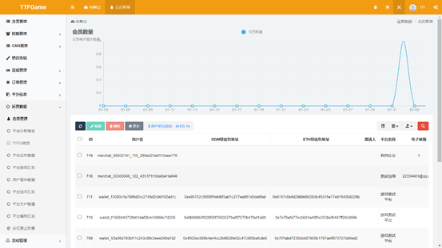

点击要修改的处罚操作栏的编辑按钮，在打开的编辑页面中完成信息编辑后点击编辑页面最下方的确定按钮即可完成修改。

可修改字段除以下两点外，字段含义和限制均与可添加字段中对各字段的介绍相同：

1、各字段默认值为要修改的处罚添加时用户填入或选择的值。

2、增加可修改的新字段状态，该字段默认值为执行，代表要修改的处罚的状态，仅能在执行、取消2个选项中进行选择。

点击要删除的处罚操作栏的删除按钮，在弹出的提示页面中确定即可完成删除。

### 5.3 如何管理平台？

展开平台信息栏后，点击展开部分中的平台管理进入平台管理页面。

点击添加按钮打开添加页面，在打开的添加页面中完善信息后点击添加页面最下方的确定按钮即可完成添加。

可添加的字段如下：

应用名称：默认值为空，该字段代表要添加的平台的应用名称，如不填写则会提示“应用名称不能为空”导致添加失败。

类名:默认值为空，该字段代表要添加的平台的类名，如不填写则会提示“类名不能为空”导致添加失败。

白名单IP：默认值为空，该字段代表要添加的平台的白名单IP。

黑名单IP：默认值为空，该字段代表要添加的平台的黑名单IP。

权重：默认值为0，该字段仅允许填入数字，该字段代表在平台管理页面中该平台的权重值，权重值越高的平台在平台管理表格中出现得越靠前。

备注：默认值为空，该字段代表要添加的平台的备注，如不填写则会提示“备注不能为空”导致添加失败。

点击要修改的平台操作栏的编辑按钮，在打开的编辑页面中完成信息编辑后点击编辑页面最下方的确定按钮即可完成修改。

可修改的字段如下：

应用名称：默认值为添加时用户所填写的应用名称，该字段代表要修改的平台的应用名称，如不填写则会提示“应用名称不能为空”导致添加失败。

应用密钥：默认值为系统随机生成，该字段代表要添加的平台的应用密钥，不支持用户手动修改，仅支持用户点击右侧更换密钥按钮后重新生成新的应用密钥。

类名：默认值为添加时用户所填写的应用名称，该字段代表要修改的平台的类名。

GP Id：默认值为空，该字段代表要修改的平台的GP Id。

黑名单IP：默认值为添加时用户所填写的黑名单IP，该字段代表要修改的平台的黑名单IP。

权重：默认值为添加时用户所填写的权重，该字段仅允许填入数字，该字段代表在平台管理页面中该平台的权重值，权重值越高的平台在平台管理表格中出现得越靠前。

备注：默认值为添加时用户所填写的备注，该字段代表要修改的平台的备注，如不填写则会提示“备注不能为空”导致添加失败。

点击要删除的平台操作栏的删除按钮，在弹出的提示页面中确定即可完成删除。**建议不要删除平台！**

## 6 活动管理详解

点击左侧导航栏中的活动管理可将其展开。

### 6.1 如何管理积分抽奖？

展开活动管理栏后，点击展开部分中的积分抽奖管理进入积分抽奖管理页面。

点击添加按钮打开添加页面，在打开的添加页面中完善信息后点击添加页面最下方的确定按钮即可完成添加。

可添加的字段如下：

平台名称：该字段代表要添加的积分抽奖所属平台的名称，用户需在下拉菜单中的所有平台中选择任一平台。

名称：默认值为空，该字段代表要添加的积分抽奖的名称，如不填写则会提示“名称不能为空”导致添加失败。

值：默认值为0，该字段仅允许填入数字，该字段代表要添加的积分抽奖的值。

兑换积分：默认值为0，该字段仅允许填入数字，该字段代表要添加的积分抽奖的兑换积分。

类型：默认值为空，该字段代表要添加的积分抽奖的类型，仅能在空、积分、TTFD/TTFG3个选项中进行选择。

大输：默认值为0，该字段仅允许填入数字，该字段代表要添加的积分抽奖大输的值。

小输：默认值为0，该字段仅允许填入数字，该字段代表要添加的积分抽奖小输的值。

小赢：默认值为0，该字段仅允许填入数字，该字段代表要添加的积分抽奖小赢的值。

大赢：默认值为0，该字段仅允许填入数字，该字段代表要添加的积分抽奖大赢的值。

排序：默认值为99，该字段仅允许填入数字，该字段代表积分抽奖页面中该抽奖的排序，排序越高的抽奖在积分抽奖管理表格中出现得越靠前。

点击要修改的积分抽奖信息操作栏的编辑按钮，在打开的编辑页面中完成信息编辑后点击编辑页面最下方的确定按钮即可完成修改。

可修改字段除各字段默认值为要修改的商品添加时用户填入或选择的值，字段含义和限制均与可添加字段中对各字段的介绍相同。

点击要删除的积分抽奖信息操作栏的删除按钮，在弹出的提示页面中确定即可完成删除。

### 6.2 如何管理合约？

展开活动管理栏后，点击展开部分中的合约管理进入合约管理页面。

点击添加按钮打开添加页面，在打开的添加页面中完善信息后点击添加页面最下方的确定按钮即可完成添加。

可添加的字段如下：

合约名称：默认值为空，该字段代表要添加的合约的名称，如不填写则会提示“名称不能为空”导致添加失败。

平台名称：该字段代表要添加的合约所属平台的名称，用户需在下拉菜单中的所有平台中选择任一平台。

开始时间：默认值为空，该字段表示要添加的合约的开始时间（即合约何时开放购买），仅支持时间格式。如不填写则会提示“开始时间不能为空”导致添加失败。

结束时间：默认值为空，该字段表示要添加的合约的结束时间（即合约何时停止购买，可在购买期内延长，但购买结束后，不可再更改），仅支持时间格式。如不填写则会提示“结束时间不能为空”导致添加失败。

存入币种：默认值为BTC，该字段代表要添加的合约的存入币种，仅能在BTC、DDMX、USDT、TTFG、ANTS、TTFD6个选项中进行选择。

收益币种：默认值为BTC，该字段代表要添加的合约的收益币种，仅能在BTC、DDMX、USDT、TTFG、ANTS、TTFD6个选项中进行选择。

币种汇率：默认值为空，该字段仅允许填入数字，该字段代表要添加的合约的存入币种与收益币种不同时两者之间的汇率，合约开始购买后不能修改。如不填写则会提示“币种汇率不能为空”导致添加失败。

合约单价：默认值为空，该字段仅允许填入数字，该字段代表一份要添加的合约的单价金额。如不填写则会提示“币种汇率不能为空”导致添加失败。

合约天数：默认值为空，该字段仅允许填入数字，该字段代表要添加的合约的收益天数。如不填写则会提示“合约天数不能为空”导致添加失败。

购买份数：默认值为空，该字段仅允许填入数字，该字段代表要添加的合约的限制购买份数。如不填写则会提示“购买份数不能为空”导致添加失败。

年化收益：默认值为空，该字段仅允许填入数字，该字段代表要添加的合约的年化率，填入数值，计算为数字/100。如不填写则会提示“年化收益不能为空”导致添加失败。

审核天数：默认值为空，该字段仅允许填入数字，该字段代表要添加的合约审核期的持续天数。如不填写则会提示“审核天数不能为空”导致添加失败。

解约返回比例：默认值为0，该字段仅允许填入数字，该字段代表要添加的合约收益期解约时返还剩余本金的比例，填入数值，计算为数字/100。如不填写则会提示“解约返回比例不能为空”导致添加失败。

是否开启：默认值为否，该字段代表是否开启前端显示，点击即可切换为是。

权重：默认值为0，该字段仅允许填入数字，该字段代表在合约管理页面中该合约的权重值，权重值越高的合约在合约管理表格中出现得越靠前。

简述：默认值为空，该字段代表要添加的合约的特色简述，如不填写则会提示“简述不能为空”导致添加失败。

合约介绍：默认值为空，该字段代表要添加的合约的详细规则说明，用户可使用富文本编辑器辅助编辑。如不填写则会提示“合约介绍不能为空”导致添加失败。

白名单：默认值为空，该字段代表要添加的合约的白名单用户ID，加入白名单的用户可以看到并操作合约，多个用户ID请用‘,’（半角）来分割。

点击要修改的合约操作栏的编辑按钮，在打开的编辑页面中完成信息编辑后点击编辑页面最下方的确定按钮即可完成修改。

可修改字段除以下两点外，字段含义和限制均与可添加字段中对各字段的介绍相同：

1、各字段默认值为要修改的合约添加时用户填入或选择的值。

2、开始时间、存入币种、收益币种、币种汇率、合约单价、合约天数、购买份数、年化收益、审核天数、解约返回比例仅可查看不可被修改。

点击要删除的合约操作栏的删除按钮，在弹出的提示页面中确定即可完成删除。

 

▶ 各页面介绍

## 1 控制台

初始页面。通过本页面可获取权限许可内的实时数据和当前的服务器信息。

同时，也支持进行浏览量与启动量的查询并生成相对应的图表。

## 2 常规管理

管理员可使用常规管理下的所有页面，管理员协作者不支持使用常规管理下的任何页面。

### 2.1 系统配置

该页面仅管理员可使用。管理员通过此界面可增改系统的变量和分组，同时也支持对分组和变量的自定义。最上方的“选择平台”支持切换不同平台进行系统配置，目前每个平台提供十个不同的系统变量分组：字典配置，交易设置，返利设置，贡献配置，抽奖设置，安全策略，合约设置，支付方式，TTFD售价，提币设置。

### 2.2 附件管理

该页面仅管理员可使用，管理员通过此页面可查看并管理上传到服务器或第三方存储的数据。

### 2.3 个人配置

分为左侧个人配置与右侧操作日志两个部分。

个人配置部分中用户可获取个人信息，同时允许用户对除用户名之外的信息进行修改。

操作日志部分中仅允许用户查看在本平台中进行的所有操作信息，不支持增删改查。

### 2.4 APP版本管理

该页面仅管理员可使用，管理员可通过此页面查看并管理各个版本APP的信息。

## 3 分类管理

仅支持管理员使用，用于统一管理所有网站的分类，分类可进行无限级分类。支持对各个分类信息进行查看。

## 4 权限管理

管理员可使用权限管理下的所有分页，管理员协作者和开发者可使用权限管理下的部分分页，开发者协作者不可使用权限管理。

### 4.1 协作者管理

该页面管理员可使用。

管理员可在本页面中获取自己及其余管理员协作者，开发者与开发者协作者的信息。

### 4.2 管理员日志

该页面管理员，管理员协作者均可使用。平台用户可通过该页面根据自己的权限查看对应的管理员日志。

管理员可在本页面中获取自己及其余管理员协作者，开发者与开发者协作者的日志信息。

管理员协作者仅能获取自己的日志信息。

日志信息允许用户进行查询与删除操作，不允许进行添加与修改操作。

### 4.3 角色组

该页面仅管理员可使用。管理员可在此查看并编辑拥有上下级层次关系的多个角色组。

点击编辑按钮后即进入对应角色组的编辑页面，该页面中可修改对应角色组的父级，名称和权限。

### 4.4 测试账号

该页面管理员，管理员协作者均可使用。平台用户可通过该页面根据自己的权限查看对应的测试账号信息。

管理员与管理员协作者可查看全平台的测试账号。

### 4.5 开发者审核

该页面管理员与管理员协作者均可使用。管理员与管理员协作者可在该页面查看开发者与开发者协作者的审核申请信息。仅支持查看，删除和修改操作，不支持添加操作。

审核信息仅支持修改状态和审核建议。点击任一条审核信息操作栏中的审核详情按钮进入审核详情页面，通过在该页面下修改状态和审核建议以达到令该条审核信息通过或未通过并将审核建议以平台通知的形式自动发送给该条审核信息的申请者的效果。

## 5 CMS管理

管理员与管理员协作者可使用CMS管理下的所有页面。

### 5.1 内容管理

该页面管理员，管理员协作者均可使用。平台用户可根据自身权限于本页面查看各个栏目下的文章列表。

管理员与管理员协作者可查看管理所有平台下所有栏目中的文章。

### 5.2 栏目管理

该页面管理员与管理员协作者均可使用。通过该页面可查看全平台下所有栏目的栏目信息，管理网站的分类。

### 5.3 单页管理

该页面管理员，管理员协作者均可使用。平台用户可根据自身权限于本页面查看管理网站中的单页面。

管理员与管理员协作者可查看管理所有平台下的单页。

## 6 修改密码

该页面中用户可以修改新的登录密码。

## 7 游戏管理

管理员可使用游戏管理下的所有页面。管理员协作者仅可使用游戏管理下的部分页面。

### 7.1 游戏接入

该页面管理员可使用。通过该页面用户可以查看并管理游戏接入信息。仅支持用户进行搜索，修改和删除操作，不支持添加操作。

管理员可以查看管理所有平台游戏的游戏接入信息，同时支持在本页面对这些游戏进行游戏发布或撤回。

### 7.2 游戏管理

该页面所有平台用户皆可使用。通过本页面用户可查看管理游戏信息。

管理员与管理员协作者可查看管理所有平台的全部游戏信息，同时支持进行游戏信息审核。

### 7.3 类型管理

该页面所有平台用户皆可使用。通过本页面用户可查看管理游戏类型信息。

管理员与管理员协作者可查看管理所有平台全部游戏的类型信息。

### 7.4 标签管理

该页面所有平台用户皆可使用。通过本页面用户可查看游戏标签信息，不支持添加，修改和删除。

管理员与管理员协作者可查看所有平台全部游戏的标签信息。

### 7.5 轮播图管理

该页面所有平台用户皆可使用。通过本页面用户可查看管理轮播图信息。

管理员与管理员协作者可查看管理所有平台全部游戏的轮播图信息。

### 7.6 礼包管理

本页面管理员，管理员协作者均可使用。通过本页面用户可查看管理游戏礼包信息。

管理员与管理员协作者可查看管理所有平台全部游戏的礼包信息。

### 7.7 商品管理

本页面管理员，管理员协作者均可使用。通过本页面用户可查看管理游戏商品信息。

管理员与管理员协作者可查看管理所有平台全部游戏的商品信息。

## 8 订单管理

管理员与管理员协作者均可使用订单管理下的所有页面。订单管理下的所有页面均只支持用户查看或搜索，不支持添加修改和删除操作。

### 8.1 提币订单

本页面管理员，管理员协作者均可使用。通过本页面用户可查看提币订单信息。

管理员与管理员协作者可查看所有平台的提币订单信息。

### 8.2 交易订单

本页面管理员与管理员协作者均可使用。通过本页面用户可查看所有平台的交易订单信息。

### 8.3 游戏充值订单

本页面所有用户均可使用。通过本页面用户可查看游戏充值订单信息。

管理员与管理员协作者可查看所有平台的游戏充值订单信息。

### 8.4 分红订单

本页面管理员与管理员协作者均可使用。通过本页面用户可查看所有平台的分红订单信息。

### 8.5 回收订单

本页面所有用户均可使用。通过本页面用户可查看回收订单信息。

管理员与管理员协作者可查看所有平台的回收订单信息。

### 8.6 平台充值订单

本页面管理员，管理员协作者与开发者均可使用。通过本页面用户可查看平台充值订单信息。

管理员与管理员协作者可查看所有平台的平台充值订单信息。

### 8.7 积分抽奖订单

本页面管理员与管理员协作者均可使用。通过本页面用户可查看所有平台的积分抽奖订单信息。

### 8.8 用户发送订单

本页面管理员与管理员协作者均可使用。通过本页面用户可查看所有平台的用户发送订单信息。

### 8.9 商户流水（DDM）

本页面管理员，管理员协作者均可使用。通过本页面用户可查看商户流水(DDM)信息。

管理员与管理员协作者可查看所有平台的商户流水(DDM)信息。

### 8.10 理财购买订单

本页面管理员，管理员协作者均可使用。通过本页面用户可查看理财购买订单信息。

管理员与管理员协作者可查看所有平台的理财购买订单信息。

### 8.11 理财收益订单

本页面管理员，管理员协作者均可使用。通过本页面用户可查看理财收益订单信息。

管理员与管理员协作者可查看所有平台的理财收益订单信息。

### 8.12 理财解约订单

本页面管理员，管理员协作者均可使用。通过本页面用户可查看理财解约订单信息。

管理员与管理员协作者可查看所有平台的理财解约订单信息。

## 9 平台信息

管理员与管理员协作者均可使用平台信息下的所有页面。开发者和开发者协作者仅可使用平台信息下的部分页面。

### 9.1 平台通知

本页面所有用户均可使用。通过本页面用户可以查看与管理平台通知，同时支持用户根据权限的不同进行平台通知的发送或接收操作。

管理员与管理员协作者可通过本页面进行添加操作以发送平台通知。本页面仅支持搜索，添加与修改，不支持删除操作。

### 9.2 开发者处罚记录

本页面管理员，管理员协作者均可使用。通过本页面用户根据权限不同可查看或管理开发者处罚记录信息。

管理员与管理员协作者可通过本页面进行添加操作以为其他被处罚的开发者添加处罚记录。

### 9.3 工单

本页面所有用户均可使用。因目前系统不支持处理工单，用户需点击“前往工单系统”按钮跳转至新的系统中继续进行操作。

### 9.4 平台管理

本页面管理员与管理员协作者均可使用。通过本页面用户可查看所有平台的平台信息并进行管理。

### 9.5 Mongo日志

本页面管理员与管理员协作者均可使用。通过本页面用户可查看所有平台的Mongo日志信息。本页面仅支持搜索，不支持添加，修改与删除。

## 10 运营数据

管理员可使用运营数据下的所有页面，管理员协作者可使用运营数据下的部分页面。运营数据下除去会员管理之外的页面均只支持搜索，不支持添加，修改和删除。

### 10.1 会员管理

本页面管理员，管理员协作者均可使用。通过本页面用户可以查看管理会员信息。

管理员与管理员协作者可以查看和管理所有平台的会员信息。

### 10.2 平台分析报表

本页面管理员与管理员协作者均可使用。通过本页面用户可以查看所有平台的分析报表信息。

### 10.3 TTFG收益

本页面仅管理员可使用。通过本页面用户可以查看所有平台的TTFG收益信息。

### 10.4 平台实时数据

本页面管理员，管理员协作者均可使用。通过本页面用户可以查看平台实时数据信息。

管理员与管理员协作者可以查看所有平台的实时数据信息。

### 10.5 平台游戏汇总

本页面管理员，管理员协作者与开发者均可使用。通过本页面用户可以查看平台游戏汇总信息。

管理员与管理员协作者可以查看所有平台的游戏汇总信息。

### 10.6 用户留存数据

本页面管理员，管理员协作者均可使用。通过本页面用户可以查看用户留存数据信息。

管理员与管理员协作者可以查看所有平台用户的留存数据信息。

### 10.7 平台法币汇总

本页面管理员，管理员协作者均可使用。通过本页面用户可以查看平台法币汇总信息。

管理员与管理员协作者可以查看所有平台的法币汇总信息。

### 10.8 平台大户数据

本页面管理员与管理员协作者均可使用。通过本页面用户可以查看所有平台的大户数据信息。

### 10.9 平台福利汇总

本页面管理员与管理员协作者均可使用。通过本页面用户可以查看所有平台的福利汇总信息。

### 10.10 分红禁止列表

本页面管理员与管理员协作者均可使用。通过本页面用户可以查看所有平台的分红禁止列表信息。

## 11 活动管理

管理员和管理员协作者可使用活动管理下的所有页面。

### 11.1 积分抽奖管理

本页面管理员与管理员协作者均可使用。通过本页面用户可以查看和管理所有平台的积分抽奖信息。

### 11.2 合约管理

本页面管理员，管理员协作者均可使用。过本页面用户可以查看和管理合约信息。

管理员与管理员协作者可以通过本页面查看和管理所有平台的合约信息。

## 12 安全策略2

管理员和管理员协作者可使用安全策略2下的所有页面。

### 12.1 预警日志

本页面管理员与管理员协作者均可使用。通过本页面用户可查看预警日志信息。本页面仅支持搜索，不支持添加，修改和删除。

